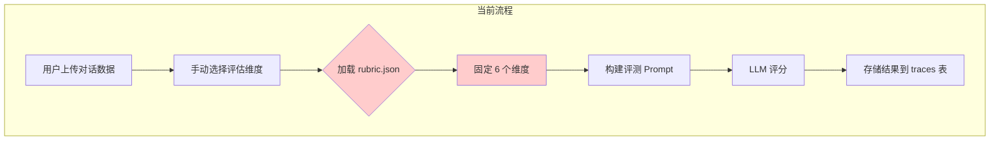
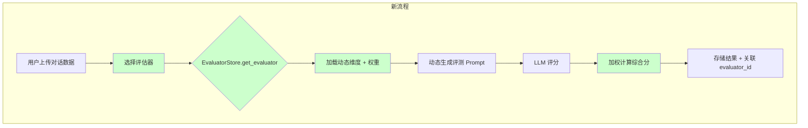
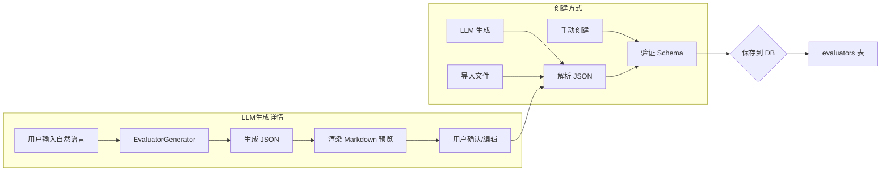
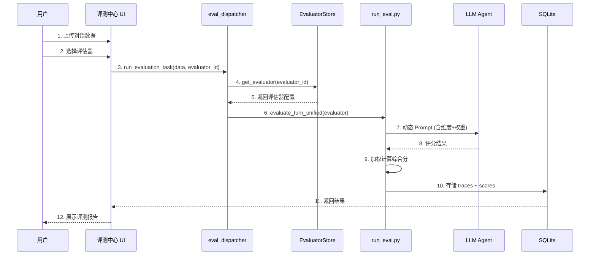

# v1.0.0 评估器功能升级方案

> **版本**: v1.0.0
> **更新日期**: 2026年1月11日
> **核心目标**: 将固定评估维度升级为可配置的「评估器」功能，支持用户自定义评估标准

---

## 一、功能概述

### 1.1 当前痛点

| 问题 | 现状 | 影响 |
|------|------|------|
| 评估维度固定 | 6个硬编码维度 ([rubric.json](file:///c:/Users/11372/Desktop/%E9%A1%B9%E7%9B%AE/%E5%A4%9A%E8%BD%AE%E5%AF%B9%E8%AF%9D%E8%AF%84%E6%B5%8B/config/rubric.json)) | 无法适应不同业务场景 |
| 无法复用 | 每次评测手动选择维度 | 重复配置工作量大 |
| 缺乏版本管理 | 修改即覆盖 | 无法追溯历史配置 |

### 1.2 目标功能

```plaintext
评估器 (Evaluator) = 可复用的评估配置模板
├── 包含: 名称、版本、适用类型、评估维度、权重
├── 来源: 手动创建 / LLM 生成 / 导入
└── 管理: 增删改查 + 版本控制
```

---

## 二、User Review Required

> [!IMPORTANT]
> **设计决策确认**:
> 1. **版本策略**: 修改评估器时是否强制创建新版本 (v1.0 → v1.1)，还是允许覆盖？
> 2. **LLM 提供商**: 转换器使用当前 [agent.py](file:///c:/Users/11372/Desktop/%E9%A1%B9%E7%9B%AE/%E5%A4%9A%E8%BD%AE%E5%AF%B9%E8%AF%9D%E8%AF%84%E6%B5%8B/agent.py) 配置的同一模型，还是支持独立配置？
> 3. **迁移策略**: 现有 [rubric.json](file:///c:/Users/11372/Desktop/%E9%A1%B9%E7%9B%AE/%E5%A4%9A%E8%BD%AE%E5%AF%B9%E8%AF%9D%E8%AF%84%E6%B5%8B/config/rubric.json) 迁移为「系统默认评估器」后，原文件是否保留？

---

## 三、核心数据结构

### 3.1 评估器 JSON Schema

```json
{
  "evaluator_id": "eval_001",
  "name": "客服质量评估",
  "version": "1.0",
  "description": "适用于客服场景的对话质量评估",
  "eval_types": ["multi_turn", "single_turn"],
  "dimensions": [
    {
      "name": "情绪管理",
      "weight": 0.2,
      "description": "评估客服在对话中的情绪控制能力",
      "criteria": {
        "1": "情绪失控，使用不当语言",
        "2": "情绪波动明显",
        "3": "基本保持专业",
        "4": "情绪稳定，偶有波动",
        "5": "全程冷静专业，有效安抚用户"
      },
      "low_score_checklist": ["是否使用攻击性语言", "是否有消极回应"]
    }
  ],
  "is_default": false,
  "is_system": false,
  "created_by": "llm_generated",
  "created_at": "2026-01-11T15:00:00Z",
  "parent_version": null
}
```

### 3.2 数据库表设计

```sql
CREATE TABLE evaluators (
    id INTEGER PRIMARY KEY AUTOINCREMENT,
    evaluator_id TEXT UNIQUE NOT NULL,
    name TEXT NOT NULL,
    version TEXT DEFAULT '1.0',
    description TEXT,
    eval_types TEXT,           -- JSON: ["multi_turn", "single_turn"]
    dimensions TEXT NOT NULL,  -- JSON: 完整维度配置
    is_default BOOLEAN DEFAULT 0,
    is_system BOOLEAN DEFAULT 0,
    created_by TEXT DEFAULT 'manual',  -- manual / llm_generated / imported
    created_at TIMESTAMP DEFAULT CURRENT_TIMESTAMP,
    updated_at TIMESTAMP DEFAULT CURRENT_TIMESTAMP,
    parent_version TEXT        -- 版本溯源
);

CREATE INDEX idx_evaluators_name ON evaluators(name);
CREATE INDEX idx_evaluators_default ON evaluators(is_default);
```

### 3.3 评估链路变化 (流程图)

#### 当前评估链路 (Before)



> [!WARNING]
> **痛点**: 维度固定在 [rubric.json](file:///c:/Users/11372/Desktop/%E9%A1%B9%E7%9B%AE/%E5%A4%9A%E8%BD%AE%E5%AF%B9%E8%AF%9D%E8%AF%84%E6%B5%8B/config/rubric.json)，无法复用、无法适配不同场景。

---

#### 升级后评估链路 (After)



---

#### 评估器创建流程



---

#### 完整评测执行流程



## 四、Proposed Changes

### 4.1 后端模块

---

#### [NEW] [evaluator_store.py](file:///c:/Users/11372/Desktop/项目/多轮对话评测/evaluator_store.py)

评估器存储管理模块，核心 API：

```python
class EvaluatorStore:
    @staticmethod
    def create_evaluator(name, dimensions, eval_types, ...) -> str
    
    @staticmethod
    def get_evaluator(evaluator_id) -> Dict
    
    @staticmethod
    def list_evaluators(include_system=True) -> List[Dict]
    
    @staticmethod
    def update_evaluator(evaluator_id, ...) -> bool
    
    @staticmethod
    def delete_evaluator(evaluator_id) -> bool
    
    @staticmethod
    def set_default_evaluator(evaluator_id) -> bool
    
    @staticmethod
    def get_default_evaluator() -> Dict
    
    @staticmethod
    def create_version(evaluator_id, new_version) -> str  # 版本管理
```

---

#### [NEW] [evaluator_generator.py](file:///c:/Users/11372/Desktop/项目/多轮对话评测/evaluator_generator.py)

LLM 评估器生成器，核心功能：

```python
class EvaluatorGenerator:
    def __init__(self, agent: RealAgent):
        self.agent = agent
    
    def generate_from_text(self, user_input: str) -> Dict:
        """从自然语言生成评估器 JSON"""
        prompt = EVALUATOR_GENERATION_PROMPT.format(user_input=user_input)
        result = self.agent.chat([], prompt)
        return self._parse_and_validate(result)
    
    def generate_from_document(self, document_text: str) -> Dict:
        """从文档内容提取评估标准"""
        prompt = DOCUMENT_EXTRACTION_PROMPT.format(document=document_text)
        result = self.agent.chat([], prompt)
        return self._parse_and_validate(result)
    
    def render_as_markdown(self, evaluator_json: Dict) -> str:
        """将 JSON 渲染为可读 Markdown"""
```

---

#### [MODIFY] [database.py](file:///c:/Users/11372/Desktop/项目/多轮对话评测/database.py)

添加 `evaluators` 表初始化：

```diff
def _create_tables(self):
    # ... existing tables ...
    
+   # 评估器表
+   cursor.execute("""
+       CREATE TABLE IF NOT EXISTS evaluators (
+           id INTEGER PRIMARY KEY AUTOINCREMENT,
+           evaluator_id TEXT UNIQUE NOT NULL,
+           name TEXT NOT NULL,
+           version TEXT DEFAULT '1.0',
+           description TEXT,
+           eval_types TEXT,
+           dimensions TEXT NOT NULL,
+           is_default BOOLEAN DEFAULT 0,
+           is_system BOOLEAN DEFAULT 0,
+           created_by TEXT DEFAULT 'manual',
+           created_at TIMESTAMP DEFAULT CURRENT_TIMESTAMP,
+           updated_at TIMESTAMP DEFAULT CURRENT_TIMESTAMP,
+           parent_version TEXT
+       )
+   """)
```

---

#### [MODIFY] [run_eval.py](file:///c:/Users/11372/Desktop/项目/多轮对话评测/run_eval.py)

支持动态评估器：

```diff
def evaluate_turn_unified(agent: RealAgent, 
                         history: List[Dict], 
                         target_response: str, 
-                        rubrics: List[Dict], 
+                        evaluator: Dict,  # 🆕 使用评估器对象
                         domain: str = "general") -> Dict:
    """使用评估器进行评测"""
+   rubrics = evaluator.get('dimensions', [])
+   # 动态生成维度文本，支持权重显示
+   dimensions_text = _format_dimensions_with_weights(rubrics)
    ...
```

---

### 4.2 前端页面

---

#### [MODIFY] [app.py](file:///c:/Users/11372/Desktop/项目/多轮对话评测/app.py)

**系统设置 - 新增评估器管理 Tab**:

```plaintext
⚙️ 系统设置
├── 🛠️ 评分维度 (原有)
├── 🧪 评估器管理 (🆕)  ← 新增
│   ├── 评估器列表 (表格展示)
│   ├── 创建评估器
│   │   ├── 方式1: 手动输入 (表单)
│   │   └── 方式2: LLM 生成 (文本框 + 预览)
│   ├── 编辑评估器
│   ├── 删除评估器
│   └── 设为默认
└── 🎨 Prompt 模板 (原有)
```

**评测中心 - 替换维度选择为评估器选择**:

```diff
# Step 3: 配置选择
- st.subheader("选择评测维度")
- selected_dims = st.multiselect("选择维度", ...)
+ st.subheader("选择评估器")
+ evaluators = EvaluatorStore.list_evaluators()
+ selected_evaluator = st.selectbox(
+     "评估器",
+     options=evaluators,
+     format_func=lambda x: f"{x['name']} v{x['version']}"
+ )
```

---

### 4.3 数据迁移

---

#### [NEW] [migrate_default_evaluator.py](file:///c:/Users/11372/Desktop/项目/多轮对话评测/migrate_default_evaluator.py)

将 [config/rubric.json](file:///c:/Users/11372/Desktop/%E9%A1%B9%E7%9B%AE/%E5%A4%9A%E8%BD%AE%E5%AF%B9%E8%AF%9D%E8%AF%84%E6%B5%8B/config/rubric.json) 迁移为系统默认评估器：

```python
def migrate_rubric_to_evaluator():
    """迁移现有 rubric.json 为系统默认评估器"""
    with open('config/rubric.json', 'r', encoding='utf-8') as f:
        rubric = json.load(f)
    
    EvaluatorStore.create_evaluator(
        name="系统默认评估器",
        version="1.0",
        description="从 rubric.json 迁移的默认评估维度",
        eval_types=["single_turn", "multi_turn", "agent"],
        dimensions=rubric['rubrics'],
        is_default=True,
        is_system=True,
        created_by="migrated"
    )
```

---

## 五、UI 设计

### 5.1 评估器管理页面

```plaintext
┌─────────────────────────────────────────────────────────────────────┐
│ 🧪 评估器管理                                                         │
├─────────────────────────────────────────────────────────────────────┤
│  ┌─────────────────────────────────────────────────────────────┐    │
│  │ [+ 创建评估器]  [🤖 LLM 生成]  [📥 导入]                      │    │
│  └─────────────────────────────────────────────────────────────┘    │
├─────────────────────────────────────────────────────────────────────┤
│  | 名称              | 版本 | 维度数 | 类型         | 默认 | 操作   │
│  |-------------------|------|--------|--------------|------|--------|
│  | 系统默认评估器 🔒  | 1.0  | 6      | 全部         | ⭐   | 查看   │
│  | 客服质量评估       | 2.1  | 4      | multi_turn   |      | 编辑删 │
│  | 技术支持评估       | 1.0  | 5      | agent        |      | 编辑删 │
└─────────────────────────────────────────────────────────────────────┘
```

### 5.2 LLM 生成评估器

```plaintext
┌─────────────────────────────────────────────────────────────────────┐
│ 🤖 LLM 生成评估器                                                     │
├─────────────────────────────────────────────────────────────────────┤
│  输入方式:  ○ 自然语言描述  ○ 上传文档                                │
├─────────────────────────────────────────────────────────────────────┤
│  ┌─────────────────────────────────────────────────────────────────┐│
│  │ 请描述您的评估需求...                                            ││
│  │                                                                  ││
│  │ 例如：我需要一个评估客服对话的评估器，重点关注：                   ││
│  │ 1. 情绪管理能力 (30%)                                            ││
│  │ 2. 问题解决率 (40%)                                              ││
│  │ 3. 沟通专业度 (30%)                                              ││
│  └─────────────────────────────────────────────────────────────────┘│
│                                                       [🔮 生成预览]   │
├─────────────────────────────────────────────────────────────────────┤
│  📋 生成预览                                                          │
│  ┌─────────────────────────────────────────────────────────────────┐│
│  │ # 客服质量评估 v1.0                                              ││
│  │                                                                  ││
│  │ ## 评估维度                                                      ││
│  │ ### 情绪管理 (权重: 30%)                                         ││
│  │ - 1分: 情绪失控，使用不当语言                                    ││
│  │ - 5分: 全程冷静专业...                                           ││
│  └─────────────────────────────────────────────────────────────────┘│
│                                        [✏️ 编辑 JSON]  [💾 保存]      │
└─────────────────────────────────────────────────────────────────────┘
```

---

## 六、新增文件清单

| 文件 | 类型 | 说明 |
|------|------|------|
| `evaluator_store.py` | 新建 | 评估器 CRUD + 版本管理 |
| `evaluator_generator.py` | 新建 | LLM 生成评估器 |
| `migrate_default_evaluator.py` | 新建 | 数据迁移脚本 |
| [database.py](file:///c:/Users/11372/Desktop/%E9%A1%B9%E7%9B%AE/%E5%A4%9A%E8%BD%AE%E5%AF%B9%E8%AF%9D%E8%AF%84%E6%B5%8B/database.py) | 修改 | 新增 evaluators 表 |
| [run_eval.py](file:///c:/Users/11372/Desktop/%E9%A1%B9%E7%9B%AE/%E5%A4%9A%E8%BD%AE%E5%AF%B9%E8%AF%9D%E8%AF%84%E6%B5%8B/run_eval.py) | 修改 | 支持动态评估器 |
| [app.py](file:///c:/Users/11372/Desktop/%E9%A1%B9%E7%9B%AE/%E5%A4%9A%E8%BD%AE%E5%AF%B9%E8%AF%9D%E8%AF%84%E6%B5%8B/app.py) | 修改 | 评估器管理 UI + 评测中心集成 |

---

## 七、Verification Plan

### 7.1 Automated Tests

**运行现有测试**:
```bash
cd c:\Users\11372\Desktop\项目\多轮对话评测
python test_comprehensive.py
```

**新增单元测试** (`test_evaluator_store.py`):
```python
def test_create_evaluator():
    """测试创建评估器"""
    
def test_list_evaluators():
    """测试列表查询"""
    
def test_update_evaluator():
    """测试更新评估器"""
    
def test_delete_evaluator():
    """测试删除评估器"""
    
def test_version_management():
    """测试版本管理"""
    
def test_llm_generator():
    """测试 LLM 生成"""
```

运行命令:
```bash
python -m pytest test_evaluator_store.py -v
```

### 7.2 Manual Verification

1. **启动应用**:
   ```bash
   streamlit run app.py
   ```

2. **测试评估器管理**:
   - 进入「系统设置」→「评估器管理」Tab
   - 验证系统默认评估器显示正确
   - 创建新评估器 (手动方式)
   - 创建新评估器 (LLM 生成方式)
   - 编辑评估器
   - 删除评估器
   - 设为默认评估器

3. **测试评测中心集成**:
   - 进入「评测中心」
   - 验证评估器下拉选择框
   - 执行一次评测，确认使用选中的评估器

4. **测试数据迁移**:
   - 确认 [rubric.json](file:///c:/Users/11372/Desktop/%E9%A1%B9%E7%9B%AE/%E5%A4%9A%E8%BD%AE%E5%AF%B9%E8%AF%9D%E8%AF%84%E6%B5%8B/config/rubric.json) 已迁移为系统评估器
   - 确认原有评测功能正常

---

## 八、实施排期

| 阶段 | 任务 | 预计工时 |
|------|------|----------|
| Phase 1 | 数据库表 + `evaluator_store.py` | 2h |
| Phase 2 | `evaluator_generator.py` (LLM) | 2h |
| Phase 3 | UI - 评估器管理页面 | 3h |
| Phase 4 | 评测中心集成 + [run_eval.py](file:///c:/Users/11372/Desktop/%E9%A1%B9%E7%9B%AE/%E5%A4%9A%E8%BD%AE%E5%AF%B9%E8%AF%9D%E8%AF%84%E6%B5%8B/run_eval.py) 改造 | 2h |
| Phase 5 | 数据迁移 + 测试 | 1h |

**总计**: ~10h
